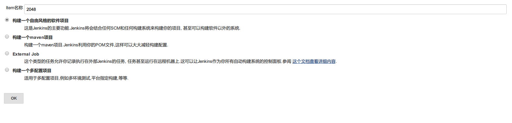
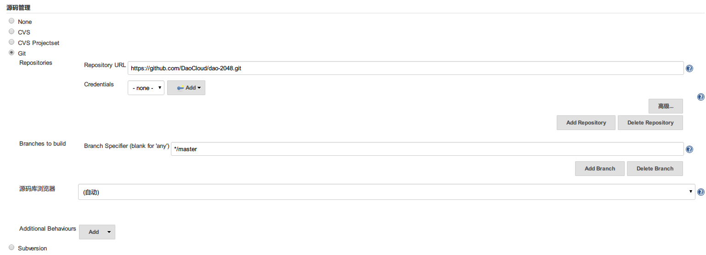
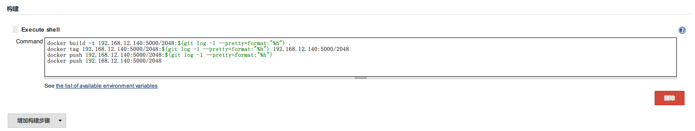
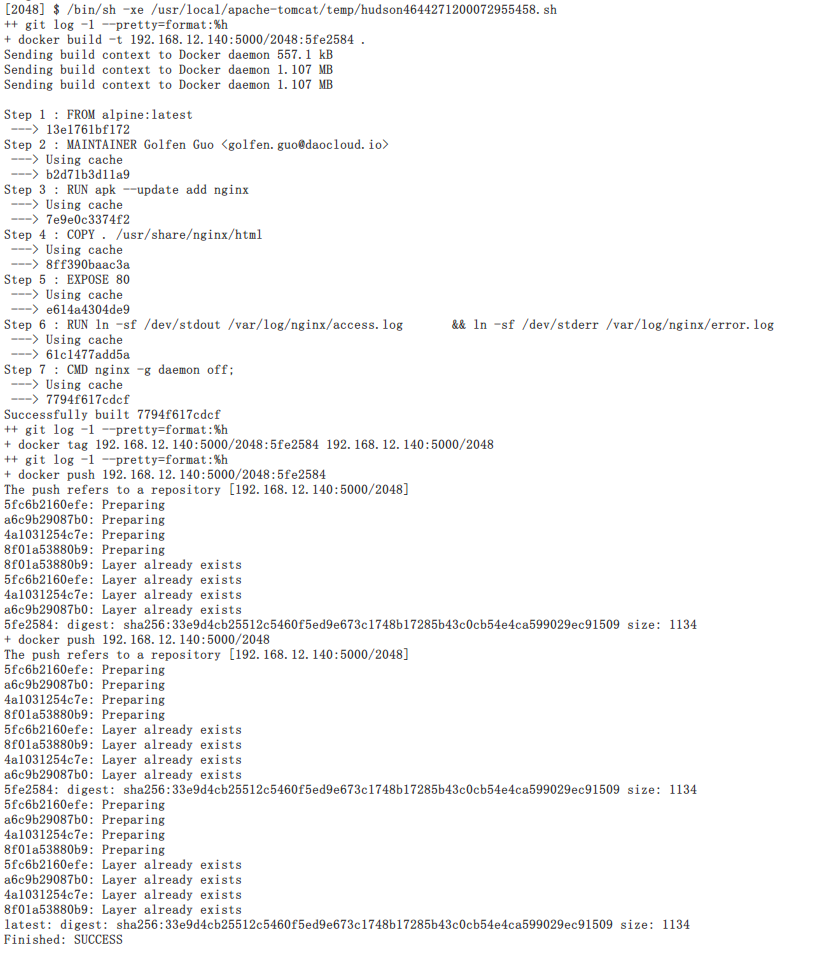
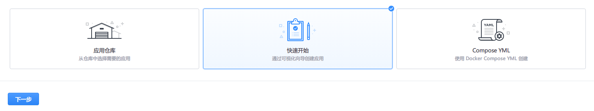
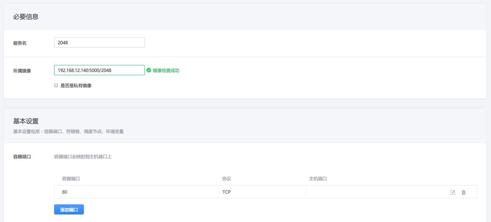
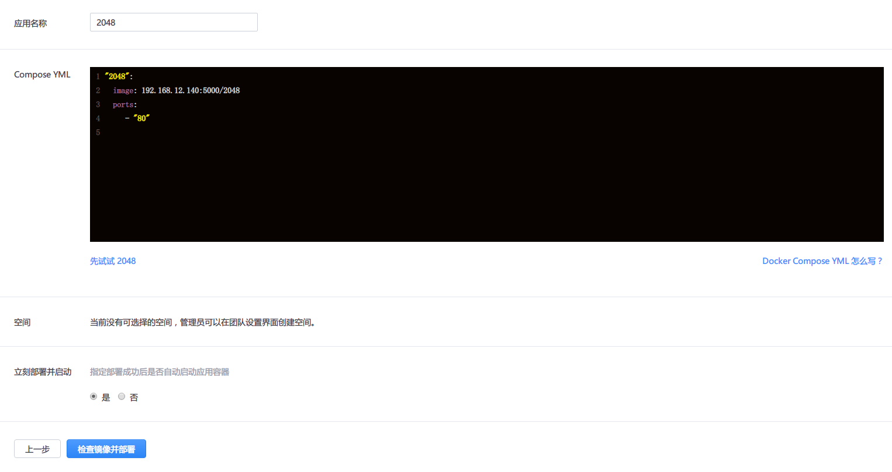
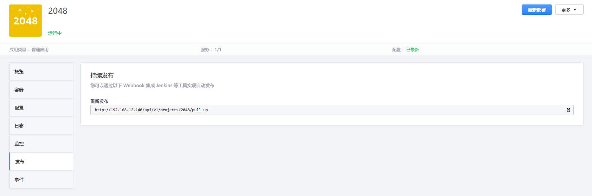
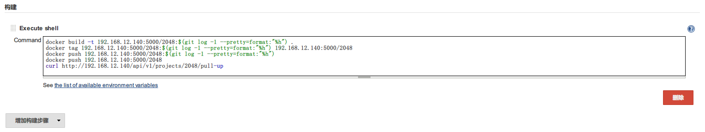

# Jenkins

## 介绍

大部分企业中使用 Jenkins 作为持续集成工具，进行代码的构建。DCE 容器管理平台可以与 Jenkins 进行对接，Jenkins 的作用是构建 Docker 镜像，DCE 使用 Jenkins 构建的镜像部署应用，做到自动化的持续发布。

Jenkins 与 DCE 对接后的集成与交付流程为：提交代码到 Git 仓库，Jenkins 拉取代码构建 Docker 镜像，DCE 拉取镜像重新部署应用，应用更新到最新版本。

在此案例中，使用 [dao-2048](https://github.com/DaoCloud/dao-2048) 作为构建镜像的代码，仓库根目录下存放有 Dockerfile，供制作镜像。在 DCE 需要配置一个应用用于部署容器，Jenkins 中需要配置一个项目来构建应用镜像。除此之外还需要提前部署一个 Registry 用于存放构建好的镜像。

## 安装

为了方便 Docker 镜像的构建，将 Jenkins 部署主机的操作系统之上。在主机上安装好 JDK，部署好 Tomcat，将下载的 Jenkins war 包放置在 Tomcat 下的 webapps 目录。建立存放 Jenkins 数据的目录，设置 JENKINS_HOME 环境变量。启动 Tomcat 服务，访问 http://IP:8080/jenkins 打开 Jenkins 配置页面。

## 使用

### Jenkins 配置

1. 新建一个自由风格的项目。

    
2. 「源码管理」中选择「Git Repositories」，填写 dao-2048 的 Git 地址。

    
3. 「构建」过程中添加「Execute shell」步骤，将构建与推送命令填写在「Command」中。此案例中代码仓库的地址为 `192.168.12.140:5000`，镜像 Tag 为提交的简短哈希值。首先构建带 Tag 的镜像，然后将此镜像标识为最新镜像，即 latest 标签，再将镜像推送到镜像仓库，更新仓库上 latest 标签指向的镜像。

    ```bash
    docker build -t 192.168.12.140:5000/2048:$(git log -1 --pretty=format:"%h") .
    docker tag 192.168.12.140:5000/2048:$(git log -1 --pretty=format:"%h") 192.168.12.140:5000/2048
    docker push 192.168.12.140:5000/2048:$(git log -1 --pretty=format:"%h")
    docker push 192.168.12.140:5000/2048
    ```

    
4. 保存配置，点击「立即构建」，查看本次构建的「Console Output」，构建成功后构建的镜像已经推送到镜像仓库。

    

### DCE 配置

1. 在「应用」中选择「创建」，选择用「快速开始」的方式来创建应用。

    
2. 填写服务名，在所属镜像处填写刚才推送过的镜像 `192.168.12.140:5000/2048`。为了每次部署最新镜像，不要加镜像的 Tag 。容器端口添加 80，然后点击「配置部署」。

    
3. 填写应用名称，点击「检查镜像并部署」。

    
4. 在应用面板切换到「发布」标签，复制「重新发布」地址。向此地址发送 GET 请求后，改应用会重新部署。

    

5. 返回到 Jenkins 的项目配置中，在构建部分增加一行命令。当每次构建镜像后，会自动触发应用重新部署。

```bash
curl http://192.168.12.140/api/v1/projects/2048/pull-up
```


